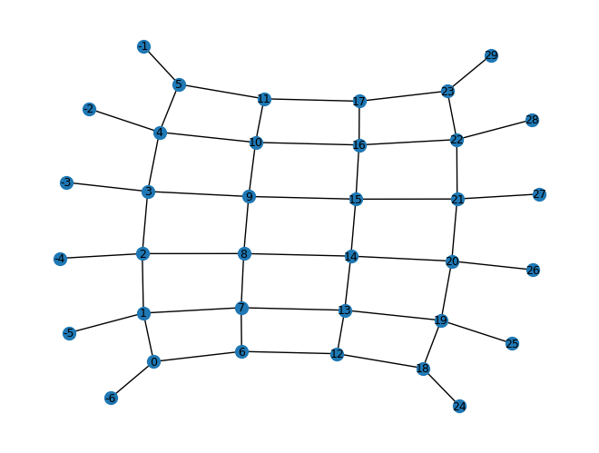

# Kitaev surface codes 

(...and other lattice based codes with MWPM-type decoders)

This repository contains a Qiskit implementation of Kitaev surface codes, a topological quantum CSS code family based on planar lattices. It shares much in common with the toric code, but the surface code is more general, flexible and its planar arrangement is easier to implement in practise. A Qiskit implementation of the toric code can be found 
[here]( https://github.com/elhyc/Kitaev-Toric-Code ).

While an implementation of the surface code is the primary motivation of this repository, the implementation can be used in more general contexts. This implementation may be used to implement *any* quantum CSS code with a MWPM (minimum-weight-perfect-matching) syndrome decoding procedure -- that is, a quantum CSS code for which syndrome measurements either come in pairs or in isolation.

## Overview

The basic premise of the planar surface code is similar to the idea behind the toric code -- [please see the description here for details](https://github.com/elhyc/Kitaev-Toric-Code). Qubits are placed on the edges of a $k_{0} \times k_{1}$ lattice grid, but unlike the toric code the lattice boundary is not considered to be periodic, so that one works with a planar lattice instead (so that the lattice topologically represents a contractible disc with boundary). Below is a figure of such a planar $5 \times 5$ lattice:

The planar lattices have two kinds of boundary edges: edges that make up the "smooth boundary" and edges that make up the "rough boundary". In the example above, the edges making up the "smooth boundary" are the edges $(0,6), (6,12), (12,18), (18,24), (24,30)$;
$(5,11), (11,17), (17,23), (23,29), (29,35)$. The edges that make up the "rough boundary" are the edges $(0,-6), (1,-5), (2,-4), (3,-3), (4,-2), (5,-1)$ ; $(35,41), (34,40), (33,39), (32,38), (31,37), (30,36)$. 

The qubits on the "smooth boundary edges" belong to a single plaquette (and two stars), while the qubits on the "rough boundary edges" belong to a single star (and two plaquettes).

